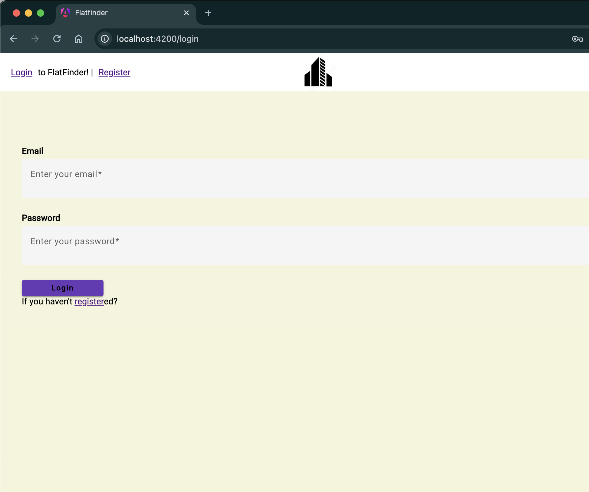

# Flatfinder

This project was generated with [Angular CLI](https://github.com/angular/angular-cli) version 17.3.11.

## Development server

Run `ng serve` for a dev server. Navigate to `http://localhost:4200/`. The application will automatically reload if you change any of the source files.

## Login informaiton
[admin]  
id: admin@gmail.com  
pw: admin123

[user]  
id: user@gmail.com  
pw: user123

# Screenshot

## Login

## Home component

## myflat component

## newflat component

## alluser component ( only for admin user )

## to install firebase

npm install @angular/fire@17 firebase